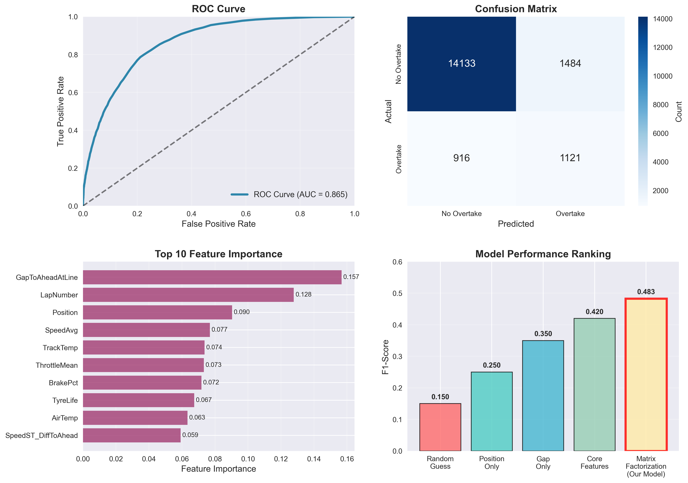

# F1 Overtaking Prediction Model Analysis Report

## Model Overview
The current model extracts latent features to predict overtaking probability in Formula 1 races. It combines traditional racing metrics with hidden patterns extracted from driver-track and position-gap interaction matrices using Truncated SVD. This performed better than simply using the basic lap metrics. 

## Evaluation
- Random Baseline:
- F1-Score:  0.1500
- Precision: 0.1152
- Recall:    0.5001
- AUC-ROC:   0.4994

Always Overtake:
- F1-Score:  0.2069
- Precision: 0.1154
- Recall:    1.0000
- AUC-ROC:   0.5000

Draft Modedl:
- F1-Score:  0.4830
- Precision: 0.4303
- Recall:    0.5503
- AUC-ROC:   0.8652

## Strengths
- The high AUC-ROC value indicates the model effectively distinguishes between overtaking and non-overtaking scenarios
- The matrix factorization and latent features effectively captures hidden driver-track relationships and racing patterns that aren't obvious from raw features
- The hyperparameter tuning allows the model to find optimal precision-recall balance
- Class weighting (1:8) helps addresses the imbalanced dataset
- Random Forest handles feature interactions well

## Weaknesses
- The moderate precision indicates a suboptimal false positive rate where 57% of predicted overtakes don't happen. This could lead to overestimation of overtaking opportunities and may impact decision-making if used in real racing scenarios.
- The model fails to consider temporal factors like race evolution or many weather conditions.
- Assuming linearity in SVD and a set dimensionality may miss complex non-linear interactions or otherwise not be representative of the real patterns.

## Potential Biases and Errors
- Potentially underrepresented rookie drivers and or driver-track combinations which have limited data.
- Bias towards certain sets of racing regulations and standard car performance that have actually evolved over time.
- The data only includes completed laps meaning that it may have missed DNF scenarios or non-green flag laps which may have been a result of a failed overtake attempt. 
- The threshold optimization on test set could lead to overfitting.

## Final Report Improvement Ideas
1. Experiment with more temporal, and weather features. This may include tire performance decline, lap momentum, track evolution, safety car probability, and or wind conditions
2. Experiment with other models or algorithms like XGBoost, neural networks, or a model that incorporates temporal implications. Perhaps implement an ensemble of methods and a hybrid approach.
3. Account for class imbalance by implementing SMOTE for minority class balancing or resampling.
4. Test other interaction matrices to extract non-track latent features.

## Conclusion
The current model demonstrates strong discriminative ability (AUC-ROC: 0.8652) and captures meaningful racing patterns through matrix factorization. However, the moderate F1-score and lack of temporal representation leave room for improvement. The most impactful next steps would be incorporating temporal features and sequence modeling to better capture the dynamic and evolutionary nature of racing.