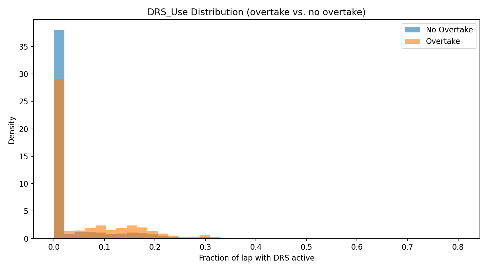
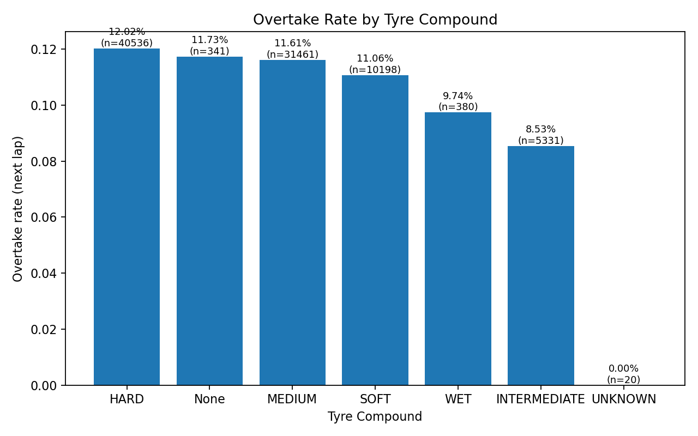
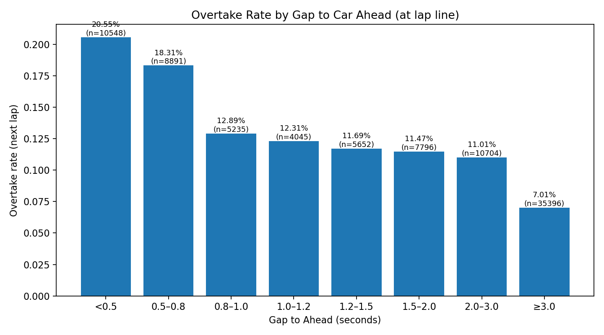

# Exploratory Data Analysis

### Variables
Each record in the dataset represents one race lap and contains a diverse range of associated information describing both car performance and external conditions. Specifically, it contains timing data such as sector times and total lap time, tyre information including tyre life, compound type, and whether the tyre set was new or used, as well as race context variables such as the driver’s position, track status, and event location. I also merged in weather features such as track temperature, air temperature, wind speed, humidity, and rainfall as these environmental factors may influence performance.

### Data Volume
The dataset contains all Formula 1 race laps from the 2021 to 2024 seasons, comprising of over 88,000 laps. This provides a large and representative sample of race data while maintaining temporal relevance; I was concerned that expanding my data too much would be problematic as FIA regulations have evolved over time. For this reason, using recent seasons ensures that the dataset reflects current car behavior, tyre characteristics, and strategy patterns under contemporary rules. It also allows for potential driver considerations as drivers have remained somewhat consistent within these seasons. With that being said, Fast F1 has much more historical data and continuously updates, so if needed I can choose to expand the data set. 

### Missingness
Pit-in and pit-out laps, as well as laps completed under non-green flag conditions (e.g., Safety Car or Virtual Safety Car), were manually excluded to focus on representative race-pace laps.

When searching for missing data I found 20 null values for LapTime and unknown or null tyre compound information, but I discovered these rows corresponded to the second lap of the Belgian Grand Prix in 2021. This consistency across all 20 drivers indicates some race event, not a data quality issue. Other missing lap times typically correspond to incomplete or invalid laps, such as those affected by retirements (DNFs), which is natural and expeected behavior.

As a precautionary measure, missing numerical values were filled with the median of each column, which is robust to outliers and preserves central tendencies without distorting distributions. Furthermore, null compound types were filled with the label "UNKNOWN" to maintain a consistent categorical structure. These steps ensured that the dataset is both clean and analytically stable, while preserving important race patterns and relationships across laps. With that being said, I do not believe these efforts to be important as Fast F1 seems to have already performed data preprocessing. This preprocessing consists of aligning standardizing variable types, and handling missing sensor readings with median imputation

### Signals / Feature Ideas
Feature Engineering:
SpeedAvg: average speed over the lap
SpeedMax: maximum speed reached over the lap
ThrottleMean: average throttle over the lap
BrakePct: fraction of telemetry samples with braking active
DRS_Use: fraction of telemetry samples with DRS activated
GapToAheadAtLine: time gap to the car ahead at the end of the lap
AheadDriver: driver one place ahead
SpeedST_DiffToAhead: difference in speeds between car and car ahead

Target Variable:
Overtake next lap (calculated based on change in position): whether the car/driver overtook someone in the next lap 

In terms of signals, I think that DRS use, gap to ahead, and difference in speed to next driver will be key predictors. I am interested to see whether tyre life and weather are also good signals. I'd also be curious to explore interactions between similar drivers or conditions. I am not yet ready to rule out an variables and still plan on exploring a vast set of combinations of features. Given the quality of predictors I do not forsee a strong need for latent features. 

### Visuals

The plot shows the distribution of no overtake and overtake laps versus proportion of DRS use. Shockingly, we can observe a relatively similar form between the two overlapping graphs. This may indicate that DRS use may be less useful that I had once thought, or require further engineering to extract this stronger signal. 

This demonstrates that tyre compound doesn't have a significant affect on overtake likelihood. With that being said it would be interesting to focus on cases where the two competing drivers have varying tyre compounds and or tyre life. 

As expected, a smaller gap between drivers indicates a higher likelihood of an overtake in the next lap. With that being said the likelihood did not decrease as rapidly as I had anticipated. Gaps over 3 seconds still accounted for 7% of overtakes, which is not insignificant. I'd like to further explore whether these cases can be explained by other factors such as crashes, pit stops, or tyre degredation. 

### 1. What is your dataset and why did you choose it?
The dataset was formed from the open-source Fast F1 Python library which downloads official FIA timing, lap, and telemetry data and exposes them as pandas DataFrames. I formed my dataset by combining lap and weather data from all race sessions within 2021 and 2024 to form `f1.csv` or `f1.parquet`. I chose this source as it is well maintained, reliable, robust, and plentiful. The data has already undergone some preprocessing, with missing laps or sensors median-filled. Fast F1 includes robust data sets including car, driver, lap, position, race conrol messages, session, timing, track status, and weather data. My focus was on combining session lap information with weather data and telemetry-derived features (e.g., average speed, throttle, braking, DRS usage) to capture both performance and contextual factors that would likely influence race dynamics.

### 2. What did you learn from your EDA?
Exploratory analysis suggested that “Gap to Ahead” and “DRS Use” may not be as predictive signals for race dynamics and overtaking behavior as predicted seeing as much can change between laps. A driver may not be in close proximity or DRS range in the previous lap, but then suddenly close the gap and overtake all within the next lap. Although these would likely be strong signals within a lap and in moments before a possible overtake, they may be as useful when predicting a lap ahead.

### 3. What issues or open questions remain?
A likely challeng is class imbalance as approximately 10,185 of 88,268 laps (~11%) form the positive class (overtake occurs in the next lap). This imbalance may complicate model training and evaluation by biasing predictions toward the majority “no overtake” class. It will be important to take this into consideration in order to prevent creating misleading performative metrics. 

Track-specific effects remains up to question. Intuitively, overtaking opportunities differ widely across circuits due to layout, road/track width, DRS zone placement, and corner types. Future work could explore normalizing or scaling features (such as GapToAhead or DRS_Use) relative to historical overtaking frequency at each circuit, or incorporating circuit-level contextual variables to improve model generalization. I am also unsure if the weather features will be useful as there doesn't seem to be much variation, especially within a single race.